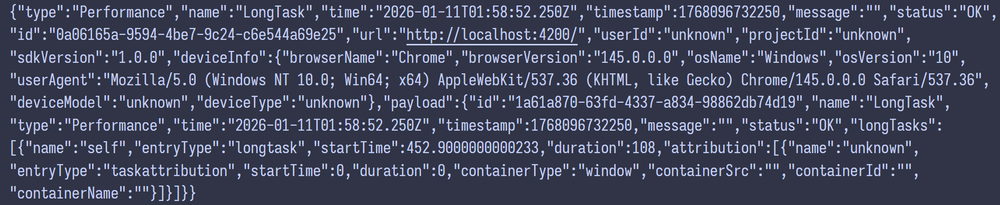

# lark-sentry

- Vue3
- React
- Angular
- ...

## Rollup

```bash
pnpm add rollup -D

pnpm add \
@rollup/plugin-commonjs \
@rollup/plugin-json
@rollup/plugin-node-resolve \
@rollup/plugin-terser \
# @rollup/plugin-typescript \
-D

pnpm add rollup-plugin-esbuild -D
pnpm add rollup-plugin-dts -D

pnpm add tslib -D
```

## Client

pnpm-workspace.yaml

```yaml
packages:
  - "packages/*"
  - "client"
```

Install dependencies

```bash
rm -rf ./client/pnpm-lock.yaml

pnpm add @lark-sentry/core --filter client
pnpm add @lark-sentry/performance --filter client
pnpm add @lark-sentry/screen-record --filter client
```

Update ./client/vite.config.ts (Optional)

```ts
import { defineConfig } from "vite";

export default defineConfig({
  optimizeDeps: {
    // 禁止预构建依赖
    exclude: [
      "@lark-sentry/core",
      "@lark-sentry/performance",
      "@lark-sentry/screen-record",
    ],
  },
});
```

Update ./client/src/main.ts[x]

```ts
import { init, use } from "@lark-sentry/core";
import PerformancePlugin from "@lark-sentry/performance";
import ScreenRecordPlugin from "@lark-sentry/screen-record";

init({ dsn: "http://127.0.0.1:8080/api/log" });
use(PerformancePlugin);
use(ScreenRecordPlugin);
```

## Server

```bash
cd ./server
uv sync
uv run ./main.py
```

## Logs



## package.json

```json
{
  "type": "module",
  // main: cjs 入口
  "main": "./dist/index.cjs",
  // module: esm 入口
  "module": "./dist/index.js",
  // types: ts 类型声明入口
  "types": "./dist/index.d.ts",
  "exports": {
    ".": {
      // exports.types: ts 类型声明入口
      "types": "./dist/index.d.ts",
      // exports.import: esm 入口, 优先级高于 module
      "import": "./dist/index.js",
      // exports.require: cjs 入口, 优先级高于 main
      "require": "./dist/index.cjs"
    }
  },
  // files: 发布到 npm 时包含的文件/目录
  "files": ["dist"],
  "publishConfig": {
    "access": "public"
  }
}
```

## npm

```bash
npm whoami
npm login

pnpm publish -r --access public --no-git-checks
```
